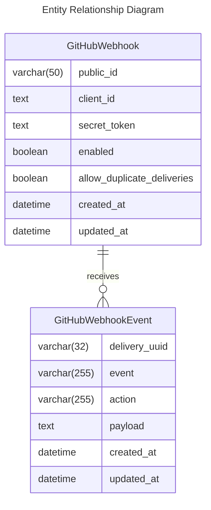

# astra

```mermaid
---
title: Entity Relationship Diagram
---
erDiagram
    GitHubWebhook ||--o{ GitHubWebhookEvent : receives
    GitHubWebhook {
        varchar(50) public_id
        text client_id
        text secret_token
        boolean enabled
        boolean allow_duplicate_deliveries
        datetime created_at
        datetime updated_at
    }
    GitHubWebhookEvent {
        varchar(32) delivery_uuid
        varchar(255) event
        varchar(255) action
        text payload
        datetime created_at
        datetime updated_at
    }
```
